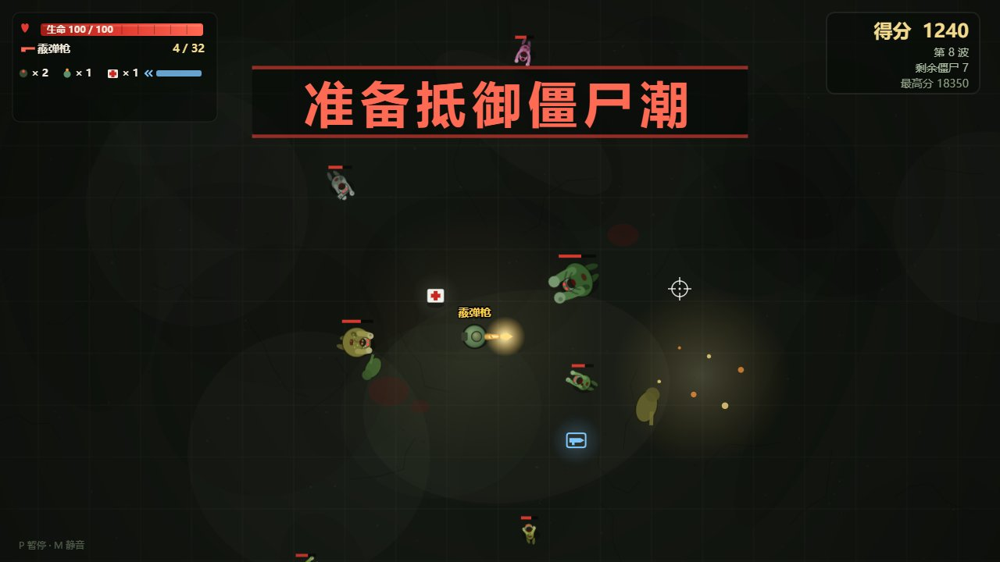

# 僵尸危机 (Zombie Crisis)

[](./#-技术实现)
[](./#-技术实现)
[](./lang)
[](#-license)

> 纯原生 Canvas 打造的俯视角僵尸生存射击 Roguelike。**零依赖、零构建、零外部资源 —— 双击即玩，完全离线。**

夜晚降临，僵尸潮从四面八方涌来。守住每一波，捡装备、抽强化、换火力，活得越久，得分越高。



## ✨ 特性一览

- 🧟 **7 种特殊僵尸**：不只是体型差异 —— 远程吐酸、贴身自爆、子弹减伤的装甲者、会"狂化"尸群的尖啸者，各有专属机制与造型
- 👹 **每 5 波 Boss 战，5 只循环轮换**：屠夫（近身震地）· 腐化母体（喷酸扇面 + 召唤尸群）· **冲撞者**（预警线 + 直线猛冲，撞完硬直）· **迫击者**（带落点警示圈的炮击）· **纳尸者**（把尸体重新拉起来），专属血条与掉落雨
- 🔫 **8 种武器，分三档强度**：直射档 → 范围档 → **顶级档（蜂群导弹 / 吞噬滚球）**，顶级档掉落最稀有也最强；含**瞬发贯穿狙击**、**命中点燃的火焰喷射器**、**连锁闪电持续放电**、**撞墙反弹且越弹越痛的跳弹枪**、**滚过僵尸就吃掉长大的吞噬滚球**……每种都有独立的射速/弹匣/换弹/后坐/音色
- 🐾 **宠物**：开局前选一只，它会跟着你**自动攻击**并靠击杀**升级**（普通 3 选一 / VIP 5 选一；VIP 上限更高还会每 5 级**进化**）
- 🔥 **连杀倍率**：2.5 秒内连续击杀不断累积，最高得分 ×2；连杀音调随之升高，击杀大体型还会触发顿帧打击感
- 🗺️ **波次肃清后四选一强化卡**（11 种、可叠层）， Roguelike 式成长，越打越强
- 💣 **投掷物与装备栏**：手雷、燃烧瓶（火焰地带持续灼烧）、医疗包库存化随取随用
- 👑 **双模式**：普通用户的完整挑战 vs VIP 用户的满级爽玩
- ⚡ **全程序化表现**：闪电链、爆炸、火海、弹壳抛掷、血迹残留、倒地尸体、屏幕震动、受伤红晕 —— 无任何图片/音频文件
- 🌐 **中英双语**，游戏内一键切换
- 🏆 **本机排行榜**：最高分前 10 名（分数 / 波次 / 击杀 / 模式 / 时间），开始界面左上角随时可看，结算时高亮你刚打出的那一条
- 🛑 **随时结束本局**：暂停菜单里可直接「结束本局」进结算，成绩照样记入排行榜 —— 不用非得等被打死

## 🎮 快速开始

**方式一（推荐）**：直接双击 `index.html`，浏览器打开即玩。

**方式二**：起一个本地静态服务器（任选其一）：

```bash
python -m http.server 8080
# 或
npx http-server -p 8080
```

然后访问 `http://localhost:8080`。

> 无需安装任何依赖，无需构建。建议使用现代 Chromium / Firefox 浏览器。

## 🕹️ 操作说明

| 按键 | 功能 |
|---|---|
| `W A S D` / 方向键 | 移动 |
| 鼠标 / 左键 | 瞄准 / 射击（部分武器为半自动点射） |
| `R` | 装填 |
| `G` / 右键 | 投掷手雷 |
| `F` | 投掷燃烧瓶 |
| `Q` | 使用医疗包（库存制，满血不浪费） |
| `X` | 丢弃当前枪支（默认武器不可丢；旧枪连同剩余弹药留在地上） |
| `Shift` / `空格` | 冲刺闪避（短暂无敌帧） |
| `P` / `Esc` | 暂停 |
| 暂停菜单「结束本局」 | 主动结束这一局：直接进结算，成绩照样记入排行榜 |
| `M` | 静音 |
| `L` | 切换中 / English |

## 🏆 排行榜

开始界面**左上角**的「排行榜」按钮打开。记录存在本机 `localStorage` 里
（本作零依赖、不发任何网络请求，所以榜就是**本机榜**，最多 10 条），
每条含 **分数 / 波次 / 击杀 / 模式 / 时间**。

- 按分数降序；**同分时先打出的排前面**
- 结算界面会显示**本局排名**，并把刚打完的那一条在榜单里高亮出来（前 5 名内时可见）
- **主动结束本局也算成绩**：暂停 → 「结束本局」 → 结算并记入榜单；认输也是一局的合法结局
- 榜单可清空（面板里的「清空记录」，**两段式确认**，清空不可撤销）

## 🧟 僵尸图鉴

| 类型 | 登场 | 特殊机制 |
|---|---|---|
| 普通感染者 | 第 1 波 | 标准近战 |
| 疾跑者 | 第 2 波 | 高速蛇形走位突进 |
| 吐酸者 | 第 3 波 | 中距离喷吐酸弹（可躲避的敌方弹幕） |
| 自爆者 | 第 3 波 | 贴身后引爆，波及玩家与同伴，可殉爆连锁 |
| 装甲者 | 第 4 波 | 子弹伤害 -40%，但爆炸与火焰全额生效 |
| 尖啸者 | 第 5 波 | 周期性尖啸，狂化周围尸群（加速 50%）——优先击杀！ |
| 重装巨兽 | 第 4 波 | 巨型近战肉盾 |

> **随波次成长（血量 / 伤害）**：杂兵血量走**复利** `hp × 1.11^(波次-1)`——第 10 波 77、
> 第 20 波 218、第 30 波 619。必须复利，因为玩家的输出是**乘算**成长（强化卡拉满约 ×9.6、
> 再叠加武器箱升级），旧版的线性 `hp + 波次 × 5` 在 30 波只涨到 5 倍，实测最强武器
> 第 1 波和第 30 波杀杂兵的耗时几乎一样，后期「随便就秒杀」。
> Boss 基础血本来就高（900 上下），同用复利会在第 30 波变成两万血的血包，所以它走
> **线性比例** `hp × (1 + 0.12 × (波次-1))`（第 30 波约 4.5 倍基准）。
> 僵尸伤害同样随波次上涨（每波 ×1.05）但**封顶 4 倍**（第 30 波触顶：普通 10 → 40）——
> 后期真的会死人，但不会一碰就死。
> 四个旋钮都在 `js/data.js`：`HP_GROW` / `BOSS_HP_GROW` / `DMG_GROW` / `DMG_GROW_CAP`。

## 👹 Boss 战（每 5 波，5 只循环轮换）

第 5、10、15… 波会先放杂兵铺场，1.6 秒后投放一个 **Boss**（顺序固定、循环登场）。Boss 血量是同期杂兵的 30 倍以上，
登场有全屏震动 + 冲击环 + 广播，顶部中央显示专属血条，击杀时大爆炸 + **掉落雨**（5 件补给）+ 重顿帧。

| Boss | 机制 | 应对 |
|---|---|---|
| **屠夫** | 巨型近战，贴近后每 3.4 秒**震地**（150 范围伤害） | 保持距离、利用冲刺拉开 |
| **腐化母体** | 太近就后撤，中距离喷**酸弹扇面**（一次 5 发），每 9 秒**召唤 5 只尸群** | 必须主动压上去速杀，拖久了场会被铺满 |
| **冲撞者** | 站定蓄力（地上画出**橙色预警线**）→ 直线猛冲，撞中重击并把你撞飞 → 撞完**硬直 1.7 秒** | 横向闪避躲过冲刺，抓硬直窗口狠狠输出 |
| **迫击者** | 保持远距离，抛射**带落点警示圈**的炮弹（1~2 发，引信 1.15 秒） | 别站桩：警示圈收缩到内圈时离开 |
| **纳尸者** | 把地上的**尸体重新拉起来**并回复自身血量 | 打完就走位离开尸体堆，或优先秒掉它 |

> 出场顺序写在 `js/data.js` 的 `BOSS_ORDER`，改数组即可调整轮换。
> 「预警」是本作对 Boss 的一贯要求：**冲撞的预警线、炮击的落点圈、硬直的金圈**都必须先看得见再挨打 —— 看不见的机制是耍赖，不是难度。

## 🔫 武器库

| 武器 | 类型 | 弹匣/备弹 | 特色 |
|---|---|---|---|
| 冲锋枪 | 全自动 | 45 / 180 | 速射泼水 |
| 加特林 | 全自动 | **200 / 800** | 极限射速压制，**子弹可穿透 1 个目标** |
| 火焰喷射器 | 全自动 | 260 / 620 | 近距火舌，命中点燃地面持续灼烧；装甲者的克星 |
| 特斯拉电枪 | 半自动 | 6 / 24 | 闪电在僵尸间连锁跳跃（最多 9 跳），持续放电逐渐扣血 |
| 磁轨狙击枪 | 半自动 | 5 / 20 | 瞬发贯穿一条直线上的**全部**僵尸 |
| **跳弹枪** | 全自动 | 18 / 140 | 子弹**撞到场地边缘会反弹**，每次反弹伤害递增（最多 6 次）—— 封闭场地里越打越热闹，奖励贴墙与斜线打法 |
| 🔥 **蜂群导弹** | 半自动 | 4 / 16 | 一次扣扳机**齐射 10 枚**追踪导弹 —— 弹幕饱和 |
| 🔥 **吞噬滚球** | 半自动 | 3 / 12 | 滚出一颗带齿的球，**碾过的僵尸被吃掉、球越滚越大越痛**，时间到原地内爆 —— 一局内的成长感看得见 |

武器由僵尸掉落的**武器箱**提供；备弹打空后自动退回默认武器（普通用户退特斯拉电枪，VIP 退无限弹匣加特林）。
每把枪有**独立音色与后坐/震动等级**，火力升级时听得出、也推得动。

> **换枪规则**：走近武器箱 = 新枪直接顶掉手里的枪，**旧枪不再掉到地上**。
> 旧设计把旧枪留在脚边，而地上的武器箱被捡起时会把弹药填满 —— 于是「丢下 → 走回去捡」
> 就能无限刷子弹（本次已修）。现在只有按 `X` 主动丢枪才会在地上留下箱子，并且
> **带着当时的弹匣与备弹**，捡回来不补满；自己刚丢的枪要走开一段距离才能再捡。
> **默认武器不受影响**：它永远在手（备弹打空自动退回），既不会被顶掉，也不会落地。
> 一帧最多捡一把枪，踩进一堆箱子时逐帧拾取。
>
> 强度分三档：直射档（冲锋枪/加特林）＜ 范围档（火焰/跳弹/特斯拉/狙击）＜ **顶级档（蜂群/吞噬滚球）**。
> 顶级档合计占武器掉落的 18%（蜂群 10% / 吞噬滚球 8%）—— 稀有但不会整局摸不到。

## 🃏 强化卡牌（每波肃清后四选一）

火力强化 · 快速扳机 · 扩容弹匣 · 熟练装填 · 疾跑 · 强壮体格 · 弱点打击（暴击） · 军火补给（投掷物上限） · 自愈体质 · 防弹背心 · 助燃剂

每种卡可叠加多层（有上限），效果持续整局。卡面直接显示**这一项的真实数值（当前 → 选后）**，
例如 `×1.00 → ×1.15`，不必靠描述里的百分比去心算。

> **卡片对每把枪都真的有用。** 火力强化与弱点打击作用于**全部伤害来源**——直击、穿透、爆炸
> （蜂群的溅射）、吞食滚球的碾压、特斯拉放电、燃烧地带，不再出现"拿了暴击但对
> 手里的枪毫无作用"的情况（暴击伤害为 **2.5 倍**，对持续伤害按期望值结算以免每帧抖动）。
> 助燃剂只对真能造成灼烧的武器（火焰喷射器）出现，其余武器抽卡时会被过滤掉，不会浪费一个位置；
> VIP 的无限弹匣加特林更是连「扩容弹匣 / 熟练装填」都不会出现 —— 对无限弹匣毫无意义。

## 🐾 宠物（开局前在开始界面选择）

宠物会跟着你，**自动攻击僵尸**，并靠击杀累积经验**自动升级**：等级越高，伤害、体型、攻速一起变强。
选定的宠物会被记住，下次直接沿用。

| 宠物 | 定位 | 机制 |
|---|---|---|
| **猎犬** | 近战 | 冲到最近的僵尸身上撕咬，单体高伤 + 击退 |
| **浮游炮** | 远程 | 跟在你身边悬浮，点射最近的目标 |
| **光环灵** | 辅助 | 不主动攻击：持续治疗你，并拖慢范围内的僵尸 |
| ⭐ **雷灵** | VIP | 连锁闪电，一次电到一串（每进化 +2 跳） |
| ⭐ **环刃卫** | VIP | 环着你转的刀轮：僵尸进入射程就**脱手飞出去追踪最近的那只**，命中后飞回轨道等下一轮（每进化 +1 片刀，就能同时飞出去更多把） |

> 普通用户 **3 选一**；VIP 用户 **5 选一**（多两只专属，开始界面上带 VIP 标）。
> **成长上 VIP 也更夸张**：普通模式封顶 **10 级**，VIP 封顶 **15 级**，且 VIP **每 5 级进化一次**
> —— 外形改变 + 机制增强（猎犬咬中带一圈冲击、浮游炮多一发、雷灵多 2 跳、环刃卫多 1 片刀）。
> 宠物不会被打死：本作只做「陪你打」这一层，不引入受伤/复活系统。
> 等级与经验条常驻在 HUD 左下，宠物头顶也会实时显示 `Lv.N`。

## 👑 模式对比

| | 普通用户 | VIP 用户 |
|---|---|---|
| 开局武器 | 特斯拉电枪 · 无限子弹 | **无限弹匣加特林**（弹匣无限 · 永不换弹 · 备弹无限） |
| 加特林专属强化 | — | **伤害 +50%** |
| 宠物 | 3 选一 · 封顶 10 级 | **5 选一（多 2 只专属）· 封顶 15 级 · 每 5 级进化** |
| 视觉标识 | 蓝色面板 | **金色光环 + ★ VIP 徽章** |
| 通用特权<br>（两模式相同） | 伤害 +15% · 移速 +10% · 得分 ×2 · 复活甲 ×2<br>紧急力场 · 每 20 秒空投 · 每波回血 +35<br>冲刺冷却 1.75s · 强化卡四选一 · 投掷物与医疗满载 | **完整继承普通用户的全部特权** |

## 📁 项目结构

```
zombie-crisis/
├── index.html          # 页面结构（纯 HTML）
├── css/
│   └── style.css       # 界面样式
├── js/
│   ├── util.js         # localStorage 安全读写封装（内嵌环境兜底）
│   ├── audio.js        # WebAudio 程序化音效（零音频文件）
│   ├── data.js         # 数据：武器 / 强化卡 / 僵尸种类 / 宠物 + 卡牌系统
│   ├── base.js         # 基础层：画布 / 全局工具 / resize / DOM 引用
│   ├── gfx.js          # 视觉资源：地面烘焙 / 精灵预渲染 / 暗角
│   ├── state.js        # 状态机：模式 / reset / 波次 / Boss 投放 / 结算与主动结束
│   ├── board.js        # 排行榜：本机榜读写、排序截断、榜单渲染
│   ├── entities.js     # 实体：生成 / 击杀收尾 / 掉落 / 空间哈希
│   ├── input.js        # 输入：键盘 / 鼠标事件接线 + 开始界面宠物栏 + 排行榜面板
│   ├── combat.js       # 武器与伤害：射击 / 投掷物 / 爆炸 / 受击
│   ├── pets.js         # 宠物：五种 AI / 升级与进化 / 绘制
│   ├── update.js       # 逐帧更新逻辑
│   ├── render.js       # 逐帧渲染：场景合成
│   ├── hud.js          # HUD / Boss 血条 / 波次横幅 / 准星
│   └── main.js         # 入口：初始化顺序（resize → reset）+ 主循环
└── lang/
    ├── zh.js           # 中文语言包
    ├── en.js           # 英文语言包
    └── i18n.js         # 多语言加载器（检测 / 切换 / 回退）
```

## 🛠 技术实现

- **渲染**：原生 Canvas 2D，支持高分屏（DPR 缩放）；僵尸/地面/光晕等静态元素预渲染离屏画布，动态元素逐帧绘制
- **音效**：WebAudio 振荡器 + 噪声实时合成，无任何音频文件
- **多语言**：每语言一个独立语言包文件，主代码只引用 key；新增语言只需复制一份 `lang/xx.js`
- **存档**：localStorage 记录最高分 / 语言 / 静音 / 模式偏好
- **依赖**：0。无框架、无构建、无网络请求，全部逻辑本地运行
- **数值曲线**：杂兵血量复利、Boss 线性比例、僵尸伤害复利封顶，旋钮集中在 `js/data.js` 的 `zombieHp()` / `zombieDmg()`（见「僵尸图鉴」下的说明）

## 📄 License

[MIT](LICENSE) © 僵尸危机贡献者
